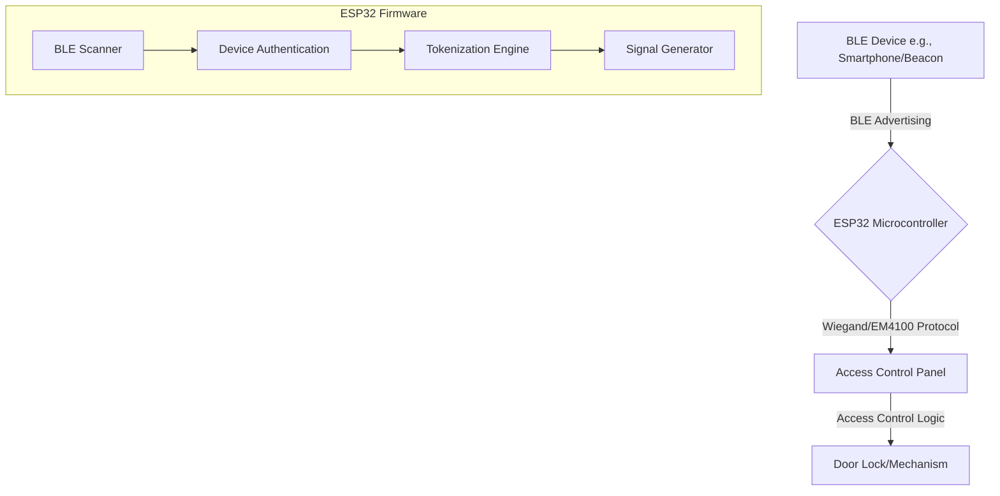

# ESP32 Bluetooth to Wiegand/EM4100 Access Control System

This project transforms an ESP32 microcontroller into a sophisticated Bluetooth Low Energy (BLE) to access control bridge, enabling modern, keyless access control using smartphones, BLE beacons, or other Bluetooth devices. It supports multiple output formats including **Wiegand 26-bit**, **Wiegand 34-bit**, and **EM4100 40-bit**, making it compatible with virtually all access control systems.

Upon detecting an authorized BLE device, the ESP32 generates and transmits the corresponding credential in your chosen format, allowing you to unlock doors or grant access with the proximity of your Bluetooth device.

## Table of Contents

- [Features](#features)
- [System Architecture](#system-architecture)
- [Hardware Requirements](#hardware-requirements)
- [Wiring Diagram](#wiring-diagram)
- [Software Setup](#software-setup)
- [Firmware Configuration and Upload](#firmware-configuration-and-upload)
- [Access Controller Configuration](#access-controller-configuration)
- [Usage](#usage)
- [Troubleshooting](#troubleshooting)

## Features

- **Triple Format Support**: Transmits Wiegand 26-bit, Wiegand 34-bit, and EM4100 40-bit signals.
- **BLE Device-as-Credential**: Use any BLE device with a static MAC address (smartphone, beacon, etc.) as an access token.
- **Configurable & Secure**: Easily configure authorized devices, output format, and facility codes directly in the firmware.
- **Debounce Mechanism**: Prevents multiple rapid-fire reads of the same device, ensuring stable operation.
- **Debug Mode**: Includes a serial debug mode for easy setup and troubleshooting.
- **Universal Compatibility**: Works with Paxton Net2 Plus and most other access control systems that accept Wiegand or EM4100 inputs.
- **Helper Tooling**: Includes a Python script to convert MAC addresses to credentials for easy setup in your access control software.

## System Architecture

The system operates in a simple, robust loop:

1.  **Scan**: The ESP32 continuously scans for BLE advertising packets.
2.  **Authenticate**: When a device is detected, its MAC address is compared against a pre-defined list of authorized devices.
3.  **Tokenize**: If the device is authorized, its MAC address is converted into a unique credential (card number, facility code, etc.).
4.  **Transmit**: The ESP32 generates the precise electrical signals for the corresponding format and sends them to the access control panel.



## Hardware Requirements

| Component               | Quantity | Description                                                                 |
| ----------------------- | -------- | --------------------------------------------------------------------------- |
| ESP32 Development Board | 1        | Any standard ESP32 board (e.g., ESP32-DevKitC, NodeMCU-32S).                |
| Power Supply            | 1        | A micro-USB cable or a 5V/3.3V power supply for the ESP32.                  |
| Jumper Wires            | 3        | To connect the ESP32 to the access control panel.                           |

## Wiring Diagram

Connecting the ESP32 to your access control panel is straightforward. Use the following connections. **Note**: The GPIO pins are configurable in the firmware.

| ESP32 Pin         | Access Panel Terminal | Description   |
| ----------------- | --------------------- | ------------- |
| **GPIO 25** (D25) | `D0` / `Data0`        | Data 0 line   |
| **GPIO 26** (D26) | `D1` / `Data1`        | Data 1 line   |
| **GND**           | `0V` / `Ground`       | Common Ground |

Make sure to establish a common ground between the ESP32 and the access control panel for reliable communication.

## Software Setup

### 1. Arduino IDE

- Download and install the [Arduino IDE](https://www.arduino.cc/en/software).
- Install the ESP32 board support package. You can follow this tutorial from Random Nerd Tutorials: [Installing the ESP32 Board in Arduino IDE](https://randomnerdtutorials.com/installing-the-esp32-board-in-arduino-ide-windows-instructions/).

### 2. ESP32 Libraries

This project relies on the built-in ESP32 libraries for BLE functionality. No external libraries are required for the BLE part.

### 3. Project Files

Place the following files in the same Arduino sketch folder (e.g., `ble_wiegand_access_control`):

- `ble_wiegand_access_control.ino` (Main firmware file)
- `wiegandOutput.h` (Wiegand/EM4100 library header)

## Firmware Configuration and Upload

### 1. Configure the Firmware

Open `ble_wiegand_access_control.ino` in the Arduino IDE. All configuration is done in the `CONFIGURATION` section at the top of the file.

- **`WIEGAND_D0_PIN` / `WIEGAND_D1_PIN`**: Set the GPIO pins connected to your controller. Defaults are `25` and `26`.
- **`OUTPUT_FORMAT`**: Choose the output format:
  - `26` = Wiegand 26-bit
  - `34` = Wiegand 34-bit
  - `40` = EM4100 40-bit
  
- **`FACILITY_CODE`**: If using 26-bit Wiegand format, set your desired facility code (0-255).
- **`authorizedDevices[]`**: **This is the most important step.** Add the MAC addresses of the BLE devices you want to grant access to. 

  ```cpp
  const char* authorizedDevices[] = {
    "AA:BB:CC:DD:EE:FF",  // Your Smartphone
    "11:22:33:44:55:66",  // Your BLE Beacon
  };
  ```

### 2. Upload to ESP32

- In the Arduino IDE, go to **Tools > Board** and select your ESP32 board model.
- Select the correct COM port under **Tools > Port**.
- Click the **Upload** button.

### 3. Verify Operation

- Open the **Serial Monitor** (**Tools > Serial Monitor**) and set the baud rate to **115200**.
- You should see the ESP32 initialize and start scanning for BLE devices.
- Bring an authorized BLE device near the ESP32. You will see a confirmation message in the Serial Monitor, and the data will be sent to the controller.

## Access Controller Configuration

To make your access control system recognize the credentials sent by the ESP32, you need to add the corresponding users and tokens in your controller software.

### Using the `mac_to_credential.py` Tool

We have included a Python script in the `tools` directory to make this process easy.

1.  **Install Python**: If you don't have Python, install it from [python.org](https://www.python.org/downloads/).
2.  **List Your MACs**: Create a text file (e.g., `my_devices.txt`) and list the MAC addresses of your authorized devices, one per line.
3.  **Run the Converter**: Open a terminal or command prompt, navigate to the `tools` directory, and run the script:

    ```bash
    # This command will create a CSV file with all formats
    python mac_to_credential.py -i my_devices.txt -o credentials.csv
    
    # Or for a specific format only
    python mac_to_credential.py -i my_devices.txt -o credentials.csv -f 40
    ```

4.  **Add Users in Your Controller**: 
    - Open the generated CSV file. It will contain the exact credentials for each of your MAC addresses.
    - In your access control software (e.g., Paxton Net2), add a new user.
    - Enter the credentials from the CSV file:
      - **For Wiegand 26/34**: Enter Facility Code and Card Number
      - **For EM4100**: Enter Version and Card ID (or just the Card ID if version is not used)

## Output Format Details

### Wiegand 26-bit
- **Total**: 26 bits (24 data bits + 2 parity bits)
- **Facility Code**: 8 bits (0-255) - Static, configured in firmware
- **Card Number**: 16 bits (0-65,535) - From last 2 bytes of MAC address
- **Use Case**: Most common format, widely compatible

### Wiegand 34-bit
- **Total**: 34 bits (32 data bits + 2 parity bits)
- **Facility Code**: 16 bits (0-65,535) - From bytes 3-4 of MAC address
- **Card Number**: 16 bits (0-65,535) - From last 2 bytes of MAC address
- **Use Case**: Extended format for larger installations

### EM4100 40-bit
- **Total**: 40 bits (no parity bits)
- **Version**: 8 bits (0-255) - From first byte of MAC address
- **Card ID**: 32 bits (0-4,294,967,295) - From bytes 2-5 of MAC address
- **Use Case**: Compatible with EM4100 readers using Clock & Data output

## Usage

Once configured, the system is fully automatic. Simply ensure your authorized BLE device is advertising (Bluetooth is on) and bring it within range of the ESP32 reader. The ESP32 will detect it and send the credential to the access controller, which will then grant access.

## Troubleshooting

- **No Detection**: 
    - Check the Serial Monitor for any error messages.
    - Ensure the MAC address in the firmware is correct and in the proper format.
    - Make sure your BLE device is advertising. Some phones require a BLE scanner app to be running to be consistently discoverable.
    - Check the range. BLE range can be affected by walls and other interference.

- **Access Denied by Controller**: 
    - Double-check that the credentials in your controller software exactly match the output from the `mac_to_credential.py` tool.
    - Verify the output format (26, 34, or 40) is set correctly in both the ESP32 firmware and the controller configuration.
    - Check the wiring between the ESP32 and the access control panel.

- **Rapid/Multiple Reads**: 
    - The `DEVICE_COOLDOWN_MS` setting should prevent this. If it still occurs, you can try increasing the cooldown period.

- **Wrong Format**: 
    - If your controller expects EM4100 but you're sending Wiegand (or vice versa), access will be denied.
    - Use the Serial Monitor to verify what format is being transmitted.
    - Consult your controller's documentation to confirm which format it expects.

