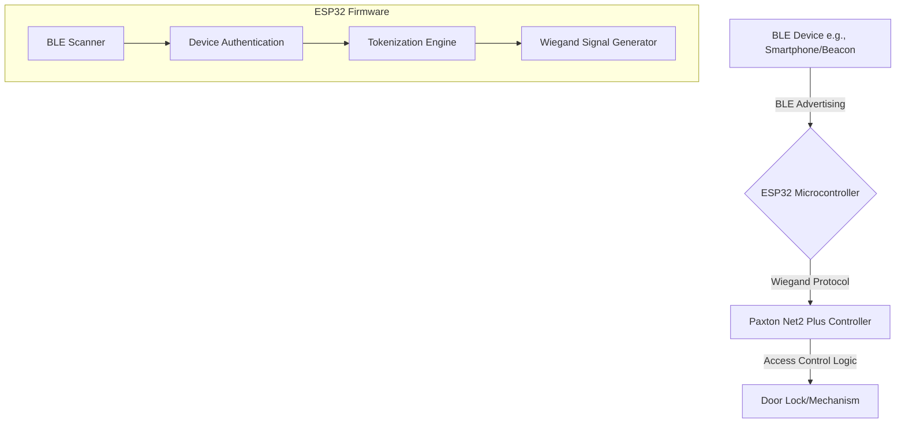

# ESP32 Bluetooth to Wiegand Access Control System

This project transforms an ESP32 microcontroller into a sophisticated Bluetooth Low Energy (BLE) to Wiegand bridge, enabling modern, keyless access control using smartphones, BLE beacons, or other Bluetooth devices. It is designed to integrate seamlessly with standard access control systems, specifically tested with the Paxton Net2 Plus controller.

Upon detecting an authorized BLE device, the ESP32 generates and transmits the corresponding credential in either Wiegand 26-bit or 34-bit format, allowing you to unlock doors or grant access with the proximity of your Bluetooth device.

## Table of Contents

- [Features](#features)
- [System Architecture](#system-architecture)
- [Hardware Requirements](#hardware-requirements)
- [Wiring Diagram](#wiring-diagram)
- [Software Setup](#software-setup)
- [Firmware Configuration and Upload](#firmware-configuration-and-upload)
- [Paxton Net2 Plus Configuration](#paxton-net2-plus-configuration)
- [Usage](#usage)
- [Troubleshooting](#troubleshooting)

## Features

- **Dual Wiegand Format Support**: Transmits both standard 26-bit and extended 34-bit Wiegand signals.
- **BLE Device-as-Credential**: Use any BLE device with a static MAC address (smartphone, beacon, etc.) as an access token.
- **Configurable & Secure**: Easily configure authorized devices, Wiegand format, and facility codes directly in the firmware.
- **Debounce Mechanism**: Prevents multiple rapid-fire reads of the same device, ensuring stable operation.
- **Debug Mode**: Includes a serial debug mode for easy setup and troubleshooting.
- **Paxton Net2 Plus Ready**: Designed and tested for compatibility with Paxton Net2 Plus access control systems.
- **Helper Tooling**: Includes a Python script to convert MAC addresses to Wiegand credentials for easy setup in your access control software.

## System Architecture

The system operates in a simple, robust loop:

1.  **Scan**: The ESP32 continuously scans for BLE advertising packets.
2.  **Authenticate**: When a device is detected, its MAC address is compared against a pre-defined list of authorized devices.
3.  **Tokenize**: If the device is authorized, its MAC address is converted into a unique Wiegand card number and facility code.
4.  **Transmit**: The ESP32 generates the precise electrical signals for the corresponding Wiegand format and sends them to the access control panel.



## Hardware Requirements

| Component               | Quantity | Description                                                                 |
| ----------------------- | -------- | --------------------------------------------------------------------------- |
| ESP32 Development Board | 1        | Any standard ESP32 board (e.g., ESP32-DevKitC, NodeMCU-32S).                |
| Power Supply            | 1        | A micro-USB cable or a 5V/3.3V power supply for the ESP32.                  |
| Jumper Wires            | 3        | To connect the ESP32 to the access control panel.                           |

## Wiring Diagram

Connecting the ESP32 to your Paxton Net2 Plus controller is straightforward. Use the following connections. **Note**: The GPIO pins are configurable in the firmware.

| ESP32 Pin         | Paxton Net2 Plus Terminal | Description   |
| ----------------- | ------------------------- | ------------- |
| **GPIO 25** (D25) | `D0` / `Data0`            | Wiegand Data 0 |
| **GPIO 26** (D26) | `D1` / `Data1`            | Wiegand Data 1 |
| **GND**           | `0V` / `Ground`           | Common Ground |

Make sure to establish a common ground between the ESP32 and the Paxton controller for reliable communication.

## Software Setup

### 1. Arduino IDE

- Download and install the [Arduino IDE](https://www.arduino.cc/en/software).
- Install the ESP32 board support package. You can follow this tutorial from Random Nerd Tutorials: [Installing the ESP32 Board in Arduino IDE](https://randomnerdtutorials.com/installing-the-esp32-board-in-arduino-ide-windows-instructions/).

### 2. ESP32 Libraries

This project relies on the built-in ESP32 libraries for BLE functionality. No external libraries are required for the BLE part.

### 3. Project Files

Place the following files in the same Arduino sketch folder (e.g., `ble_wiegand_access_control`):

- `ble_wiegand_access_control.ino` (Main firmware file)
- `wiegandOutput.h` (Wiegand library header)

## Firmware Configuration and Upload

### 1. Configure the Firmware

Open `ble_wiegand_access_control.ino` in the Arduino IDE. All configuration is done in the `CONFIGURATION` section at the top of the file.

- **`WIEGAND_D0_PIN` / `WIEGAND_D1_PIN`**: Set the GPIO pins connected to your controller. Defaults are `25` and `26`.
- **`WIEGAND_FORMAT`**: Choose `26` or `34` for the output format.
- **`FACILITY_CODE`**: If using 26-bit format, set your desired facility code (0-255).
- **`authorizedDevices[]`**: **This is the most important step.** Add the MAC addresses of the BLE devices you want to grant access to. 

  ```cpp
  const char* authorizedDevices[] = {
    "AA:BB:CC:DD:EE:FF",  // Your Smartphone
    "11:22:33:44:55:66",  // Your BLE Beacon
  };
  ```

### 2. Upload to ESP32

- In the Arduino IDE, go to **Tools > Board** and select your ESP32 board model.
- Select the correct COM port under **Tools > Port**.
- Click the **Upload** button.

### 3. Verify Operation

- Open the **Serial Monitor** (**Tools > Serial Monitor**) and set the baud rate to **115200**.
- You should see the ESP32 initialize and start scanning for BLE devices.
- Bring an authorized BLE device near the ESP32. You will see a confirmation message in the Serial Monitor, and the Wiegand data will be sent to the controller.

## Paxton Net2 Plus Configuration

To make your access control system recognize the credentials sent by the ESP32, you need to add the corresponding users and tokens in the Net2 software.

### Using the `mac_to_wiegand.py` Tool

We have included a Python script in the `tools` directory to make this process easy.

1.  **Install Python**: If you don't have Python, install it from [python.org](https://www.python.org/downloads/).
2.  **List Your MACs**: Create a text file (e.g., `my_devices.txt`) and list the MAC addresses of your authorized devices, one per line.
3.  **Run the Converter**: Open a terminal or command prompt, navigate to the `tools` directory, and run the script:

    ```bash
    # This command will create a CSV file ready for import
    python mac_to_wiegand.py -i my_devices.txt -o credentials_for_paxton.csv
    ```

4.  **Add Users in Net2**: 
    - Open the generated `credentials_for_paxton.csv` file. It will contain the exact Facility Code and Card Number for each of your MAC addresses.
    - In the Net2 software, add a new user.
    - Go to the **Cards** section for that user.
    - Click **Add** and select the appropriate card type (e.g., "Wiegand 26 bit").
    - Manually enter the **Site/Facility code** and **Card number** from the CSV file.

    Repeat this for all your authorized devices.

## Usage

Once configured, the system is fully automatic. Simply ensure your authorized BLE device is advertising (Bluetooth is on) and bring it within range of the ESP32 reader. The ESP32 will detect it and send the credential to the Paxton controller, which will then grant access.

## Troubleshooting

- **No Detection**: 
    - Check the Serial Monitor for any error messages.
    - Ensure the MAC address in the firmware is correct and in the proper format.
    - Make sure your BLE device is advertising. Some phones require a BLE scanner app to be running to be consistently discoverable.
    - Check the range. BLE range can be affected by walls and other interference.

- **Access Denied by Paxton**: 
    - Double-check that the Facility Code and Card Number in the Net2 software exactly match the output from the `mac_to_wiegand.py` tool.
    - Verify the Wiegand format (26 or 34 bit) is set correctly in both the ESP32 firmware and the Net2 reader configuration.
    - Check the wiring between the ESP32 and the Paxton controller.

- **Rapid/Multiple Reads**: 
    - The `DEVICE_COOLDOWN_MS` setting should prevent this. If it still occurs, you can try increasing the cooldown period.

